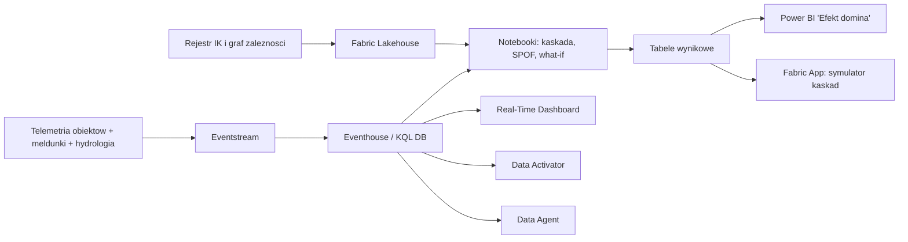

# 🧩 Efekt Domina — Infrastruktura Krytyczna

> ⚠️ **Disclaimer** — repozytorium demonstracyjne. Wszystkie dane są syntetyczne, wygenerowane proceduralnie (`generate_datasets.py`, seed=42). Nie zawiera realnych danych operacyjnych, lokalizacji ani informacji o rzeczywistej infrastrukturze krytycznej jakiegokolwiek podmiotu. Nazwy operatorów są fikcyjne i oznaczone skrótem „(fikc.)". Projekt służy wyłącznie pokazaniu mechanizmu analitycznego na platformie Microsoft Fabric.

## Problem biznesowy

Ustawa o zarządzaniu kryzysowym wymienia jedenaście systemów infrastruktury krytycznej — od
zaopatrzenia w energię po ciągłość działania administracji. Każdy z nich ma innego właściciela,
innego regulatora i inny resort wiodący. **Nikt nie ma jednego modelu zależności między nimi.**

W efekcie awaria jest analizowana w granicach jednego systemu, a skutki występują w pozostałych
dziesięciu. Energetyk widzi wyłączony GPZ. Nie widzi, że za sześć godzin czternaście przepompowni
przestanie tłoczyć wodę, że trzy szpitale przejdą na agregaty z ograniczonym zapasem paliwa i że
jedna z tych rzeczy wydarzy się zanim sztab zdąży się zebrać.

Pytanie decydenta brzmi: **jeśli ten obiekt przestanie działać, co się stanie, kogo to dotknie i ile mamy czasu.**

## Rozwiązanie

Jeden graf zależności dla wszystkich jedenastu systemów IK plus silnik propagacji kaskady, który
odpowiada na pytanie „co jeśli" w sekundach — z uwzględnieniem opóźnień technologicznych,
autonomii zasilania rezerwowego i redundancji.



Model kaskady jest prosty i wytłumaczalny na odprawie: obiekt przestaje działać, gdy traci ponad
połowę swoich wejść; skutek pojawia się po opóźnieniu wynikającym z bufora technologicznego;
zasilanie rezerwowe **ratuje** obiekt, jeśli starcza na czas przywrócenia dostawcy — a jeśli nie
starcza, tylko przesuwa awarię w czasie. Szczegóły: `cascade_engine.py`.

## Najważniejsze liczby

**Skala grafu**

- 2106 obiektów IK w 11 systemach ustawowych, 6552 zależności, 1180 gmin z co najmniej jednym obiektem.
- 132 zależności przekraczają granice województwa — awaria nie zatrzymuje się na granicy administracyjnej wojewody.
- 1025 obiektów ma tylko jedno źródło zasilania; 376 nie ma żadnego zasilania rezerwowego.
- 54 obiekty klasy K1 są poza rejestrem IK; 827 obiektów K1/K2 ma lukę we współpracy w trybie SPO-10.

**Kaskada „Powódź wrzesień"**

- 232 obiekty wyłączone bezpośrednio przez wodę → **777 obiektów niedziałających łącznie**, w tym **545 wtórnie**.
- Współczynnik wzmocnienia **2,69** — zdarzenie mnoży się prawie trzykrotnie.
- Pierwszy skutek wtórny po **33 minutach**, kaskada sięga **7. fali**.
- 200 gmin, ok. **2,63 mln mieszkańców** bez co najmniej jednej usługi (energia, woda, zdrowie).

**Pojedyncza awaria (wow moment)**

Wyłączenie jednej stacji NN 400/220 kV na Dolnym Śląsku:

> **538 453 mieszkańców bez zasilania • 104 obiekty wtórne w 6 falach • 9 szpitali (8 na agregatach, mediana autonomii 29,8 h) • 10 obiektów ratownictwa • woda przestaje płynąć po 0,9 godziny**

**Pojedyncze punkty awarii**

- 217 obiektów spełnia kryterium SPOF; 29 ma indeks kaskadowy w kategorii „krytyczny".
- Najgroźniejszy pojedynczy obiekt pozbawia usług **642 162 mieszkańców** i dotyka **wszystkich 11 systemów IK**.
- 67 obiektów SPOF nie ma umowy o wymianie danych, 46 jest poza rejestrem IK, 46 leży w strefie zalewowej.
- Na szczycie rankingu stoją **magazyny paliw**, nie elektrownie — bo zasilają generatory, które podtrzymują wszystko inne. To wniosek niemożliwy do uzyskania przy analizie każdego systemu osobno.

**Co realnie pomaga (what-if)**

| Wariant | Interwencja | Skutki wtórne | Redukcja |
|---|---|---|---|
| BAZOWY | stan obecny | 545 | — |
| A — autonomia | agregat i paliwo na 72 h w 120 obiektach usługowych K1/K2 | 414 | **24,0%** |
| B — redundancja | drugie zasilanie dla 241 obiektów K1 | 521 | 4,4% |
| C — razem | A + B | 396 | **27,3%** |

Wariant tańszy i szybszy do wdrożenia (agregaty) daje **pięciokrotnie większą redukcję** niż
wariant kapitałochłonny (nowe linie zasilające). To jest dokładnie ten rodzaj wniosku, którego
nie da się obronić na posiedzeniu bez modelu.

## Zawartość repozytorium

| Ścieżka | Rola |
|---|---|
| `generate_datasets.py` | deterministyczny generator danych syntetycznych (seed=42) |
| `cascade_engine.py` | silnik propagacji kaskady współdzielony przez notatniki |
| `simulate_realtime.py` | symulator wysyłki do Eventstream; `--dry-run` bez zależności i poświadczeń |
| `datasets\` | wymiary CSV, strumienie JSONL, `datasets\README.md` z wolumenami |
| `datasets\derived\` | wyniki: centralność kaskadowa, oś czasu, drzewo skutków, SPOF, warianty what-if |
| `notebooks\01_load_graph.py` | wczytanie i kontrola jakości grafu, wskaźniki kruchości |
| `notebooks\02_cascade_simulation.py` | kaskada powodziowa + scenariusz „wyłącz ten węzeł" |
| `notebooks\03_centrality_spof.py` | symulacja awarii każdego z 2106 obiektów, ranking i SPOF |
| `notebooks\04_hardening_whatif.py` | warianty inwestycyjne i wartość krańcowa pojedynczych wzmocnień |
| `kql\` | schematy Eventhouse, update policies, zapytania dashboardu, detekcja kaskad |
| `semantic-model\` | model semantyczny i miary DAX |
| `report\REPORT_SPEC.md` | specyfikacja 6 stron raportu Power BI |
| `fabric-app\` | specyfikacja aplikacji i prompt do generatora |
| `activator\RULES.md` | 7 reguł alertowych Data Activator |
| `ai\DATA_AGENT.md` | instrukcja Data Agent, pytania testowe i granice odpowiedzi |

## Jak uruchomić lokalnie

```powershell
cd C:\repos\OchronaLudnosci\ol-infrastruktura-krytyczna
pip install -r requirements.txt
python generate_datasets.py
python notebooks\01_load_graph.py
python notebooks\02_cascade_simulation.py
python notebooks\03_centrality_spof.py
python notebooks\04_hardening_whatif.py
python simulate_realtime.py --dry-run --stream ci_operator_reports
```

Pełny przebieg trwa kilka minut; najdłuższy jest notatnik 03 (2106 niezależnych symulacji).
`simulate_realtime.py --dry-run` nie wymaga `azure-eventhub` ani poświadczeń. Tryb online używa
zmiennych `EVENTHUB_CONNECTION_STR` i opcjonalnie `EVENTHUB_NAME`.

Wdrożenie w Microsoft Fabric — `SETUP_FABRIC.md`. Narracja prezentacji — `DEMO_SCRIPT.md`.

## Mapowanie na funkcje Fabric

| Funkcja Fabric | Zastosowanie w demie |
|---|---|
| Lakehouse | rejestr obiektów IK, graf zależności, wyniki symulacji |
| Eventstream | telemetria obiektów, meldunki operatorów, hydrologia |
| Eventhouse / KQL | stan bieżący, detekcja kaskady, prognoza kolejnych awarii |
| Notebooki | propagacja kaskady, centralność, SPOF, warianty inwestycyjne |
| Real-Time Dashboard | obraz operacyjny dyżurnego (11 kafli) |
| Power BI + model semantyczny | raport „Efekt domina" dla odprawy i decyzji budżetowej |
| Data Activator | 7 reguł: kaskada, trzeci rząd skutków, paliwo, woda, governance, anomalia |
| Data Agent | pytania w języku naturalnym, ze zdefiniowanymi granicami odpowiedzi |
| Fabric Apps | symulator kaskad z write-backiem meldunków i planu wzmocnień |
| Purview | etykiety wrażliwości; w realnym wdrożeniu graf IK jest informacją chronioną |

## Kontekst KPZK i SPO

Scenariusz osiowy: **POWÓDŹ WRZESIEŃ** (`Z02`) z kaskadą `Z07` energetyka, `Z12` telekomunikacja,
`Z14` system gazowy. Procedury: **SPO-10** (współpraca z operatorami IK) jako oś merytoryczna,
**SPO-1** (posiedzenie RZZK) i **SPO-12** (obieg informacji) przy eskalacji, **SPO-2**
(uruchomienie środków) przy dostawach paliwa. Poziomy reagowania: gmina → powiat → wojewoda →
minister wiodący → RZZK.

## Powiązanie z pozostałymi scenariuszami programu

| Repozytorium | Punkt styku |
|---|---|
| [`ol-cop24`](../ol-cop24/) | ta sama oś zdarzenia i geografia; kaskada zasila wspólny obraz sytuacji przewidywaniem, a nie tylko stanem |
| [`ol-siatka-bezpieczenstwa`](../ol-siatka-bezpieczenstwa/) | liczba dotkniętych systemów IK wskazuje działy administracji i moduły zadaniowe do aktywacji |
| [`ol-zasoby-logistyka`](../ol-zasoby-logistyka/) | kolejka paliwowa do agregatów i zapotrzebowanie na pompy to bezpośrednie wejście do planowania transportów |
| [`ol-blackout-wrazliwi`](../ol-blackout-wrazliwi/) | prognoza „woda przestanie płynąć za X godzin" trafia do priorytetyzacji ludności wrażliwej |

## Ograniczenia modelu

Model opisuje wyłącznie zależności **zadeklarowane**. W realnym wdrożeniu największym ryzykiem są
zależności nieudokumentowane — dlatego wartość rozwiązania leży nie tylko w symulacji, ale w tym,
że wymusza uporządkowanie rejestru i regularne weryfikowanie zależności w ćwiczeniach. W danych
jest to widoczne wprost: znacząca część krawędzi grafu nigdy nie została sprawdzona w ćwiczeniu.

Próg odporności 0,5 oraz opóźnienia są parametrami planistycznymi, nie pomiarami. Model wskazuje
priorytety — decyzję podejmuje człowiek.

## Licencja

MIT — patrz `LICENSE`.
